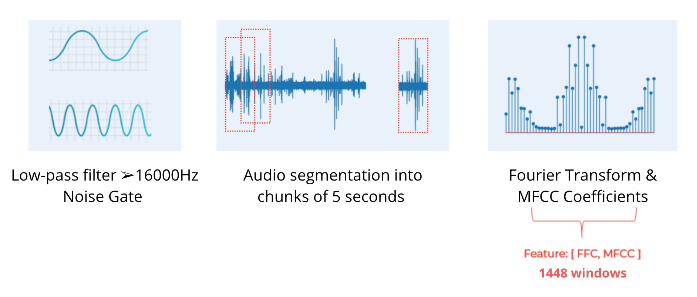
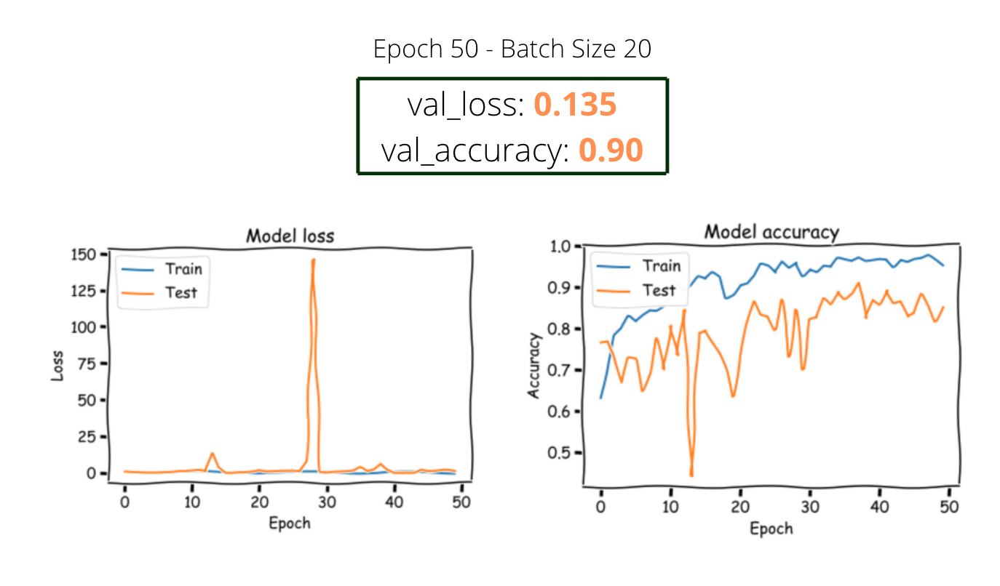

# 
Amazon-Leapers

## 
Final Project for Ironhack Data Analytics Bootcamp

**
What Does The Frog Say?🐸
**

----
**
 Audio processing & recognition | ML Neural Networks | API (flask) 
**

----

## Description 📜

Sound recognition of 5 different *familia* of frogs and toads present throughout the globe.

Have you ever heard of **Shazam**? Well..., this is about the same thing but with frogs, frogs of all kinds of shapes, colors, features, skills and poisons.

**Objective:**

`Make lives easier. From helping a zoologist differentiate a certain frog to saving an incautious tourist by warning her/him from the threat some frogs pose, all the way to taming a dimensionality of the animal kingdom that is often left unattended; sound`

## Audio Curation 🔊

As a first approximation, I selected the 5 most exotic familia for the project.

The dataset consists of 1448 rows, each contaning 5 seconds of audio split into vectors of 5102 elements each.

**Steps:**

- Low pass filter (16,000 Hz)
- Noise gate
- Split each remaining chunk into 5-second windows
- Calculate Fourier Transform for each window
- Determine the average value of the MFCC coefficients for each window

## Neural Network 🧠

Machine Learning models tried:
- RandomForestClassifier ➤ RMSE = 0.4701
- GradientBoostingClassifier() ➤ RMSE = 0.8972
- ExtraTreesClassifier() ➤ RMSE = 0.4708
- HistGradientBoostingClassifier() ➤ RMSE = 0.9000
- DecisionTreeClassifier() ➤ RMSE = 0.4700

Best performance: 
▶︎ Convolutional Neural Network  (validation accuracy = 0.90)

## API 🧩

The user uploads a recording and it is passed curated and passed through the Neural Network Model, giving back an estimation as to which frog it distinguishes and how confident it is in its answer.

**Structure:**

api.py 

➤ app routing & endpoints 

➤ HTML

audio.py 

➤ Audio Segmentation and Fourier Transform

➤ Dataframe Creation

➤ Model Predictions

## Future Steps: Geolocation 🌎 & Expansion of Recognizable Familia 👨‍👩‍👧‍👦

The next step would be for the API not only to tell you which frog you are dealing with but also its location on a map. After that enriching the dataset with more species and familia would make for the perfect project.

## Documentation 💭

https://github.com/jiaaro/pydub
https://sounds.bl.uk/Environment/Amphibians
https://keras.io/guides/functional_api/
https://flask.palletsprojects.com/en/1.1.x/patterns/fileuploads/
https://flask.palletsprojects.com/en/1.1.x/patterns/favicon/

